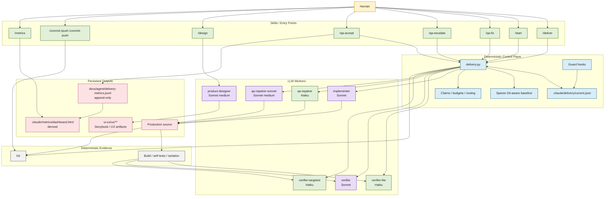
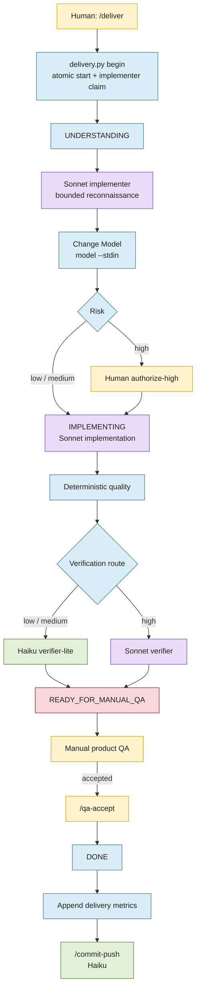
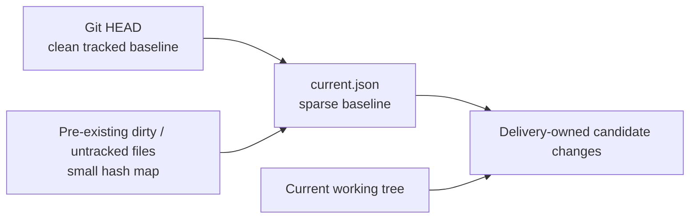
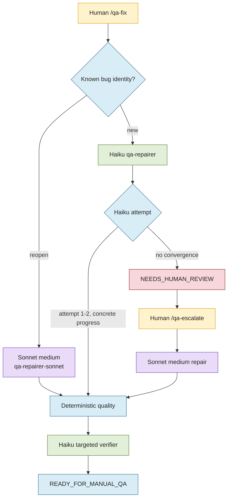
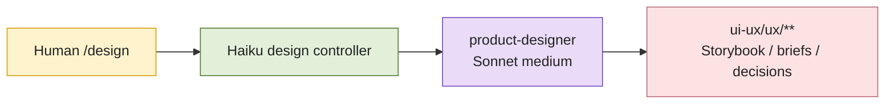
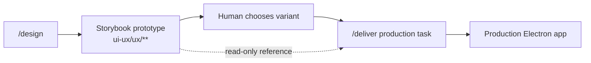
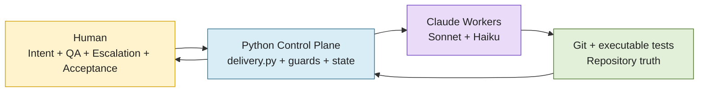

# Adeo Claude Code Delivery Architecture

> **Status:** Current workflow architecture through v3.7  
> **Scope:** Claude Code orchestration, delivery state, QA, design workflow, model routing, Git automation, and delivery metrics.

---

## 1. Purpose

This setup is designed to make Claude Code useful as a software-delivery system **without allowing the LLM to decide how much LLM work is necessary**.

The architecture separates:

- **Human authority** — defines intent, performs manual QA, approves escalation and final acceptance.
- **Deterministic control plane** — owns state transitions, budgets, claims, baselines, routing, and metrics.
- **Specialized LLM workers** — reason, implement, repair, verify, or design inside bounded scopes.
- **Git and executable checks** — provide repository truth and deterministic evidence.

The core principle is:

> **Claude does reasoning. Python controls autonomy. Git stores repository truth. Humans accept the product.**

---

## 2. Design Principles

### 2.1 LLMs do not manage their own autonomy

The workflow does **not** trust an LLM to decide:

- how many repair attempts are reasonable;
- whether another verifier pass is needed;
- whether it may escalate itself to a stronger model;
- whether a delivery is complete;
- whether repository state may be rewritten.

Those decisions are enforced by `delivery.py`, guards, and explicit human actions.

### 2.2 Human iterations are not an autonomy budget

A human starting another manual-QA cycle is a new explicit authorization.

Therefore:

- human-triggered QA batches are not capped globally;
- autonomous work **inside** a QA batch is bounded;
- Sonnet escalation requires an explicit human gate.

### 2.3 Deterministic work should stay deterministic

The workflow prefers executable checks over repeated LLM reasoning.

Examples:

- Git diff / repository state;
- build;
- self-tests;
- isolation checks;
- state transitions;
- budget counters;
- metrics aggregation;
- Git staging restrictions.

### 2.4 Model cost is a routing concern

Expensive reasoning is reserved for work that benefits from it.

- Controllers and routine Git work → **Haiku**
- Normal implementation → **Sonnet**
- Low/medium verification → **Haiku**
- High-risk verification → **Sonnet**
- First QA repair → **Haiku**
- Reopen / explicit escalation → **Sonnet medium**

---

# 3. High-Level Architecture



---

## 4. Model Routing

| Responsibility | Component | Model | Notes |
|---|---|---:|---|
| Start production delivery | `/deliver` | Haiku | Controller only |
| Resume delivery | `/start` | Haiku | Controller only |
| Understand + implement | `implementer` | Sonnet | Main reasoning-heavy worker |
| Low/medium verification | `verifier-lite` | Haiku | Uses deterministic evidence |
| High-risk verification | `verifier` | Sonnet | Reserved for genuinely risky changes |
| First manual-QA repair | `qa-repairer` | Haiku | Narrow repair |
| Reopened bug | `qa-repairer-sonnet` | Sonnet medium | Known failed repair |
| Explicit QA escalation | `qa-repairer-sonnet` | Sonnet medium | Human-authorized |
| Targeted bug verification | `verifier-targeted` | Haiku | Verifies known defect only |
| Product/UX prototype | `product-designer` | Sonnet medium | Separate design lane |
| Commit / push | `/commit*` | Haiku | Git bookkeeping |
| Metrics view | `/metrics` | Haiku wrapper | Aggregation itself is deterministic |

---

# 5. Production Feature Delivery

A normal production feature follows this path:



---

# 6. Atomic Delivery Start

Since v3.4, `/deliver` does not manually assemble a sequence of state-management commands.

The canonical entry point is:

```bash
python3 .claude/scripts/delivery.py begin \
  --task "<complete task>" \
  --target production \
  --json
```

`begin` atomically performs:

1. delivery creation;
2. transition to `UNDERSTANDING`;
3. implementer worker claim.

This avoids protocol drift such as:

```text
start
claim --agent          # invalid
worker-claim --agent   # invalid
worker-claim --role    # eventually correct
```

The controller should not guess runtime APIs.

---

# 7. Change Model Protocol

The implementer performs bounded reconnaissance and records a structured Change Model.

Canonical interface:

```bash
python3 .claude/scripts/delivery.py model --stdin
```

If the worker needs the schema:

```bash
python3 .claude/scripts/delivery.py model-template
```

The intended behavior is:

```text
UNDERSTANDING
    ↓
bounded recon
    ↓
structured JSON Change Model
    ↓
delivery.py model --stdin
    ↓
IMPLEMENTING
```

The worker should **not**:

- write `.claude/delivery/current.md`;
- reverse-engineer `delivery.py` via `grep` / `sed`;
- mutate `current.json` directly.

---

# 8. Delivery State

The active runtime state lives in:

```text
.claude/delivery/current.json
```

It is a **control-plane state file**, not a repository snapshot.

Typical contents include:

- delivery id;
- task;
- lifecycle state;
- target;
- Change Model;
- defects;
- worker/verifier claims;
- compact budgets and counters;
- sparse repository baseline.

---

# 9. Sparse Git-Aware Baseline

Earlier versions fingerprinted almost the entire repository, including PNG/JPG evidence, archives, Storybook files, and workflow files.

Current behavior uses Git as repository truth.



Conceptually:

```json
{
  "baseline": {
    "head": "9c3947c...",
    "dirty": {
      "bugs.yml": {
        "kind": "untracked",
        "sha256": "..."
      }
    }
  }
}
```

Clean tracked files are already represented by Git and do not need duplicate hashes.

Generated evidence and workflow artifacts are excluded from normal production candidate accounting.

---

# 10. Deterministic Quality

After implementation or repair, `delivery.py quality` executes known deterministic checks.

Typical checks include:

- production build;
- relevant feature self-tests;
- isolation checks;
- repository-boundary checks.

The verifier should reason **after** deterministic evidence exists.

```text
code
 ↓
build / tests / self-tests
 ↓
verifier
```

The objective is to avoid paying an LLM to rediscover facts executable code can prove.

---

# 11. Manual QA

Automated verification does not equal product acceptance.

The delivery enters:

```text
READY_FOR_MANUAL_QA
```

Manual QA is expected to cover areas that current automated checks do not reliably judge:

- layout;
- clipping;
- overlays;
- scroll behavior;
- long content;
- focus;
- drag/drop;
- interaction feel;
- visual regressions;
- edge UI states.

A delivery reaches `DONE` only after explicit human acceptance.

---

# 12. Manual QA Repair Loop

Manual defects are normally supplied through `bugs.yml`.

Example:

```yaml
bugs:
  - id: 6
    status: Open
    description: >
      Smart list is not selected after leaving a board.
    steps:
      - Open a board
      - Click a smart list
      - Observe the selected state
```

Only `Open` defects are imported.



---

# 13. QA Budgets

The system distinguishes **human iterations** from **autonomous attempts**.

Current rules:

| Scope | Limit |
|---|---:|
| Human-triggered QA batches | Unlimited |
| Open bugs imported per batch | 3 |
| Haiku QA attempts per batch | 2 |
| Same bug autonomous reopen | 1 |
| Sonnet escalation | Explicit human gate |

The principle is:

> **Human iterations are not an autonomy budget. Only autonomous work inside each human-authorized iteration is bounded.**

---

# 14. Stable Bug Identity

Standalone or older QA reports may not contain explicit IDs.

The runtime assigns deterministic IDs such as:

```text
AUTO-a83e9c712f0b
```

This allows repeated reports to be recognized as reopens.

Compact QA history can be inspected with:

```bash
python3 .claude/scripts/delivery.py qa-history --json
```

This avoids reading the entire state file just to identify a previous defect.

---

# 15. QA Escalation

A failed Haiku repair must not produce an unlimited retry loop.

After the bounded Haiku attempts are exhausted:

```text
NEEDS_HUMAN_REVIEW
```

The model may request escalation, but only a human may authorize it.

Entry point:

```text
/qa-escalate <reason>
```

Runtime command:

```bash
python3 .claude/scripts/delivery.py qa-escalate \
  --defect-id D-003 \
  --reason "<reason>"
```

The transition is:

```text
qa-repairer
    ↓
human escalation
    ↓
qa-repairer-sonnet
```

The command:

- switches the repair route;
- clears a stale worker claim;
- records the escalation;
- enables the Sonnet medium repairer.

Explicit escalation may permit a somewhat larger, still bounded structural repair when the local workaround cannot solve the root cause.

---

# 16. Product Designer Lane

Product design is intentionally separate from production delivery.

Entry point:

```text
/design
```

Available modes include:

```text
/design prototype "..."
/design requirements "..."
/design specify "..."
/design implementation-review "..."
/design audit "..."
```

Architecture:



The designer:

- does not start a production `/deliver`;
- does not claim production delivery ownership;
- writes only inside the UX/design boundary;
- is blocked while an active production delivery owns the repository.

Terminal delivery states (`DONE` / `FAILED`) with no stale claims are treated as **no active delivery**, so standalone design work remains possible.

---

# 17. From Storybook Prototype to Production

A Storybook prototype is a **read-only design reference**, not a production implementation target.

Example:

```text
/design prototype "Delete task from Edit Task dialog"
```

After selecting a variant, production implementation starts with `/deliver`:

```text
/deliver "Implement the production version of approved Storybook variant
'B — Header icon action' for deleting a task from the Edit Task dialog.
Use the existing Storybook prototype as a read-only design reference.
Implement the behavior in the production Electron app.
Do not modify ui-ux/ux/**."
```



This boundary prevents the historical failure mode where a Storybook implementation was incorrectly treated as completed production delivery.

---

# 18. Delivery Ownership Guards

Guard scripts enforce repository ownership and prevent direct state mutation.

Examples include:

- `delivery-owner-guard.py`;
- `implementer-guard.py`;
- `verifier-guard.py`.

Key rules:

- active delivery phases require the correct worker/verifier claim;
- `current.json` is mutated only by `delivery.py`;
- standalone agents are allowed when there is no active delivery;
- `DONE` / `FAILED` with no claims do not deadlock standalone design work;
- terminal state with stale claims is treated as inconsistent and remains blocked.

---

# 19. Git Workflow

Commit and push bookkeeping is delegated to Haiku.

Skills:

```text
/commit
/push
/commit-push
```

The Git worker must use explicit staging.

Allowed:

```bash
git add src/renderer/index.ts styles.css
```

Forbidden:

```bash
git add .
git add -A
git commit -a
git push --force
```

The goal is to avoid accidentally committing:

- unrelated pre-existing changes;
- random untracked files;
- delivery runtime state;
- temporary artifacts.

Production reasoning ends before Git bookkeeping begins.

---

# 20. Delivery Metrics

Accepted deliveries append one immutable JSON line to:

```text
docs/agent/delivery-metrics.jsonl
```

Example:

```json
{
  "delivery_id": "20260901-...",
  "task": "Smart-list selection...",
  "risk": "medium",
  "sonnet_implementation_passes": 1,
  "sonnet_full_verifier_passes": 0,
  "sonnet_reopen_passes": 0,
  "sonnet_qa_escalation_passes": 1,
  "haiku_agent_passes": 4,
  "haiku_qa_attempts": 2,
  "qa_escalations_to_sonnet": 1,
  "qa_batches": 2,
  "reopens": 0,
  "expensive_reasoning_passes": 2,
  "manual_acceptance": true,
  "outcome": "accepted"
}
```

The main cost KPI is:

```text
expensive_reasoning_passes =
    Sonnet implementation passes
  + Sonnet full verifier passes
  + Sonnet reopen passes
  + Sonnet QA escalation passes
```

The metric answers:

> **How many expensive reasoning passes were required to reach human acceptance?**

---

# 21. Metrics Dashboard

The append-only ledger is the source of truth.

Console report:

```bash
python3 .claude/scripts/delivery.py metrics
```

JSON:

```bash
python3 .claude/scripts/delivery.py metrics --json
```

HTML dashboard:

```bash
python3 .claude/scripts/delivery.py metrics --html --open
```

Or:

```text
/metrics
```

The generated dashboard lives at:

```text
.claude/metrics/dashboard.html
```

It is derived and disposable; it is not the source of truth.

The dashboard tracks:

- accepted features;
- complete vs partial historical records;
- average and median expensive passes;
- QA batches;
- reopen rate;
- Sonnet escalation rate;
- Haiku QA attempts;
- recent expensive deliveries;
- outliers requiring workflow analysis.

Suggested interpretation:

| Signal | Meaning |
|---|---|
| 1 expensive pass | Healthy normal delivery |
| 2 expensive passes | Worth watching |
| 3+ expensive passes | Investigate orchestration |
| 0–1 Haiku QA attempts | Healthy |
| 2 Haiku QA attempts | Warning |
| Sonnet QA escalation | Explicitly expensive path |

---

# 22. Expected Healthy Delivery

A normal medium-risk feature should ideally look like:

```text
1 × Sonnet implementation
0 × Sonnet full verifier
0 × Sonnet reopen
0 × Sonnet QA escalation
1 × human manual QA
```

A healthy repair path should ideally be:

```text
manual bug
→ 1 Haiku repair
→ deterministic checks
→ Haiku targeted verifier
→ human acceptance
```

Repeated 3–5 Sonnet passes or repeated Haiku attempts are signals that the orchestration is becoming more expensive than the work itself.

---

# 23. Directory Layout

Current conceptual layout:

```text
.claude/
├── agents/
│   ├── implementer.md
│   ├── product-designer.md
│   ├── verifier.md
│   ├── verifier-lite.md
│   ├── verifier-targeted.md
│   ├── qa-repairer.md
│   └── qa-repairer-sonnet.md
│
├── skills/
│   ├── deliver/
│   ├── start/
│   ├── qa-fix/
│   ├── qa-escalate/
│   ├── qa-accept/
│   ├── design/
│   ├── commit/
│   ├── push/
│   ├── commit-push/
│   └── metrics/
│
├── scripts/
│   ├── delivery.py
│   ├── delivery-selftest.py
│   ├── delivery-owner-guard.py
│   ├── implementer-guard.py
│   ├── verifier-guard.py
│   └── product-designer-selftest.py
│
├── delivery/
│   ├── README.md
│   └── current.json
│
└── metrics/
    ├── .gitignore
    └── dashboard.html

docs/
└── agent/
    └── delivery-metrics.jsonl

ui-ux/
└── ux/
    ├── briefs/
    ├── concepts/
    ├── decisions/
    ├── reviews/
    └── ...
```

---

# 24. Operator Runbook

## Start a production feature

```text
/deliver "Implement ..."
```

## Resume an active delivery

```text
/start
```

## Report manual QA defects

```text
/qa-fix bugs.yml
```

## Escalate a non-converging QA repair

```text
/qa-escalate <reason>
```

## Accept the production result

```text
/qa-accept Looks good
```

## Commit and push

```text
/commit-push
```

## Start UX/design work

```text
/design prototype "..."
```

## Inspect delivery metrics

```text
/metrics
```

---

# 25. Control Rules

The setup is intentionally strict about the following rules:

```text
LLM NEVER MANAGES ITS OWN BUDGET.
LLM NEVER MUTATES DELIVERY STATE DIRECTLY.
LLM NEVER DECIDES WHETHER ANOTHER AUTONOMOUS ROUND IS ALLOWED.
LLM NEVER BUILDS A FULL REPOSITORY BASELINE.
LLM NEVER REPLACES MANUAL UI QA.
```

The control plane should be boring, deterministic, and cheap.

The LLM should spend its context on:

```text
understand
reason
implement
repair
verify
design
```

—not on reverse-engineering orchestration infrastructure.

---

# 26. Architecture Summary



> **The purpose of the architecture is not maximum autonomy. It is bounded, observable, cost-efficient delivery with a human in control.**
